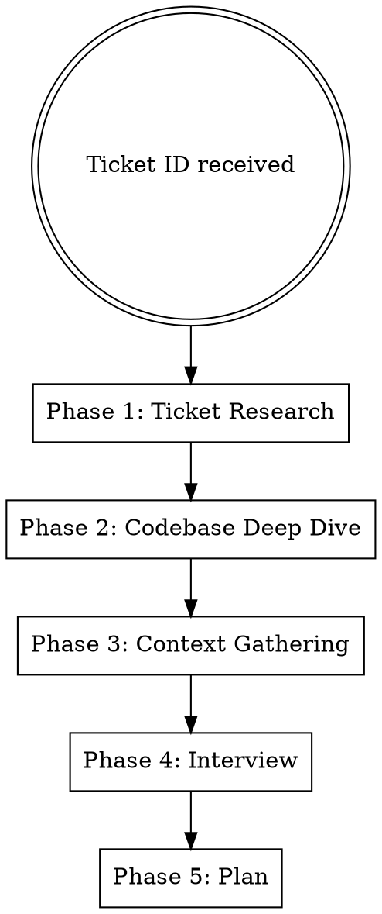

# Work on Ticket

Research a Linear ticket, explore the codebase, interview the user, and produce an implementation plan.

## Workflow

### Phase 1: Ticket Research

1. Look up the ticket with Linear MCP `get_issue` tool
2. Read comments with `list_comments` if any exist
3. Present a summary to the user: title, description, acceptance criteria, key decisions from comments

### Phase 2: Codebase Deep Dive

1. Use **Explore subagents** to trace relevant code paths, find affected files, understand existing patterns
2. Identify related tests, utilities, and conventions that should be reused
3. Build a mental map of the change surface — summarize findings to the user

**Do this BEFORE asking questions.** Come with informed questions, not generic ones.

### Phase 2.5: Briefing

After the deep dive, present a **plain-language briefing** to get the user back up to speed. The user context-switches frequently and may not remember the ticket details. The briefing should:

1. Explain the problem in simple, jargon-light terms — as if explaining to a colleague who hasn't seen the ticket
2. Include a **concrete example** showing the current (broken/missing) behavior vs the desired behavior
3. Keep it short — 3-5 sentences + the example

Example format:

> **What's going on:** Right now when a client pays with two methods (e.g. $50 cash + $50 card), the daily report queries each payment row individually in a loop — one DB query per payment. For a clinic with 200 payments/day, that's 200 queries just for one report.
>
> **What we want:** A single grouped SQL query that sums payments by type, so the report loads in 1 query instead of 200.

This briefing helps the user answer interview questions with full context.

### Phase 3: Context Gathering

Ask the user:

> "Do you have additional context from conversations, Slack, meetings, or design docs that would help?"

Wait for their response before proceeding. If they say no, move on.

### Phase 4: Thorough Interview

Ask questions **one at a time** using the `AskUserQuestion` tool with `options` for multiple-choice. This renders an interactive selection menu the user can click — never just print options as text.

Cover these areas (skip any already answered by the ticket or context):

- **Requirements gaps** — what the ticket doesn't specify
- **Edge cases and error scenarios** — what could go wrong
- **Approach trade-offs** — propose 2-3 options with a recommendation, ask which they prefer
- **Testing strategy** — what level of testing is expected
- **Scope concerns** — what's explicitly in/out

Put context/explanation in the `question` field. Put concise choice labels in `options`. Always include a free-text option like "Other (I'll explain)" so the user isn't forced into predefined choices.

When the user's answers are clear and consistent, move to Phase 5. Don't over-interview — 3-6 questions is typical.

### Phase 5: Transition to Planning

Invoke `superpowers:writing-plans` to formalize the implementation plan.

The plan should reference specific files, functions, and patterns discovered in Phase 2.

## Constraints

- Do NOT create branches — user handles that
- Do NOT auto-commit
- Deep research BEFORE questions — never ask what you could have found in the code
- Questions one at a time, multiple-choice when possible
