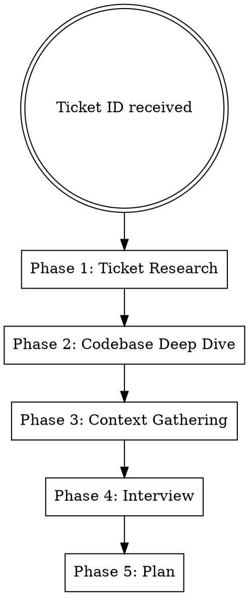

# Work on Ticket

Research a Linear ticket, explore the codebase, interview the user, and produce an implementation plan.

## Workflow


```dot
digraph work_on_ticket {
  rankdir=TB;
  "Ticket ID received" [shape=doublecircle];
  "Phase 1: Ticket Research" [shape=box];
  "Phase 2: Codebase Deep Dive" [shape=box];
  "Phase 3: Context Gathering" [shape=box];
  "Phase 4: Interview" [shape=box];
  "Phase 5: Plan" [shape=box];

  "Ticket ID received" -> "Phase 1: Ticket Research";
  "Phase 1: Ticket Research" -> "Phase 2: Codebase Deep Dive";
  "Phase 2: Codebase Deep Dive" -> "Phase 3: Context Gathering";
  "Phase 3: Context Gathering" -> "Phase 4: Interview";
  "Phase 4: Interview" -> "Phase 5: Plan";
}
```

### Phase 1: Ticket Research

1. Look up the ticket with Linear MCP `get_issue` tool
2. Read comments with `list_comments` if any exist
3. Present a summary to the user: title, description, acceptance criteria, key decisions from comments

### Phase 2: Codebase Deep Dive

1. Use **Explore subagents** to trace relevant code paths, find affected files, understand existing patterns
2. Identify related tests, utilities, and conventions that should be reused
3. Build a mental map of the change surface — summarize findings to the user

**Do this BEFORE asking questions.** Come with informed questions, not generic ones.

### Phase 2.5: Briefing

After the deep dive, present a **plain-language briefing** to get the user back up to speed AND generate a richer HTML version that auto-opens in the browser. The user context-switches frequently and may not remember the ticket details.

#### Part A — Chat briefing

Print a short briefing to chat:

1. Explain the problem in simple, jargon-light terms — as if explaining to a colleague who hasn't seen the ticket
2. Include a **concrete example** showing the current (broken/missing) behavior vs the desired behavior
3. Keep it short — 3-5 sentences + the example

Example format:

> **What's going on:** Right now when a client pays with two methods (e.g. $50 cash + $50 card), the daily report queries each payment row individually in a loop — one DB query per payment. For a clinic with 200 payments/day, that's 200 queries just for one report.
>
> **What we want:** A single grouped SQL query that sums payments by type, so the report loads in 1 query instead of 200.

This briefing flows into the interview phase.

#### Part B — HTML briefing

Generate a polished HTML page using the structure below. Reuse Phase 1 Linear data and Phase 2 findings — do NOT re-fetch.

**Steps:**

1. Target path: `~/assistant/briefings/<TICKET-ID>.html` (ensure the directory exists)
2. If the file already exists, use `AskUserQuestion` to ask: Overwrite / Keep existing / Save with timestamp suffix `<TICKET>-<YYYY-MM-DD-HHMM>.html`
3. Write the HTML file with the `Write` tool
4. Run `open <path>` via Bash to launch the default browser
5. Print a single confirmation line in chat: `Briefing → file:///Users/gonz/assistant/briefings/<TICKET-ID>.html`

**Sections (in order, skip any with no content; Header + TL;DR are mandatory):**

1. **Header** — ticket ID, title, status badge, anchor link to `https://linear.app/<workspace>/issue/<TICKET>`
2. **TL;DR callout** — the same plain-language briefing from Part A, prominent
3. **Before/After panels** — two side-by-side cards, "Before" tinted danger, "After" tinted success
4. **Mermaid diagram** — call/data flow discovered in Phase 2 (real components, not generic boxes)
5. **Affected files** — list of paths from Phase 2, each with a 1-line role
6. **Key decisions from comments** — quote-styled callouts pulled from Linear comments
7. **Code snippets** — current vs desired code, syntax-highlighted via Prism
8. **Phase 4 questions preview** — the questions you're about to ask in Phase 4

**Assets (CDN, loaded in `<head>`):**

- Mermaid: `https://cdn.jsdelivr.net/npm/mermaid@10/dist/mermaid.min.js`
- Prism core + autoloader: `https://cdn.jsdelivr.net/npm/prismjs@1/prism.min.js` and `https://cdn.jsdelivr.net/npm/prismjs@1/plugins/autoloader/prism-autoloader.min.js`
- Prism theme (Tomorrow): `https://cdn.jsdelivr.net/npm/prismjs@1/themes/prism-tomorrow.min.css`

Initialize Mermaid at the end of `<body>` with `mermaid.initialize({ startOnLoad: true, theme: 'neutral' })`.

**Style (inline `<style>` block) — easy on the eyes, no pure white or pure black:**

```css
:root {
  --bg: #f6f3ec;          /* warm off-white paper */
  --surface: #ede8dc;     /* slightly darker card surface */
  --border: #d9d2c2;
  --text: #2d2a26;        /* soft near-black, never #000 */
  --muted: #6b6558;
  --accent: #5e6ad2;
  --danger-bg: #f7e3df;   --danger-fg: #8a2a1d;
  --success-bg: #dfeede;  --success-fg: #2f6b34;
}
@media (prefers-color-scheme: dark) {
  :root {
    --bg: #1f2024;        /* soft charcoal, never #000 */
    --surface: #2a2c32;
    --border: #3a3d44;
    --text: #e6e3dc;      /* warm off-white, never #fff */
    --muted: #a3a097;
    --accent: #8b95e8;
    --danger-bg: #3a2622; --danger-fg: #f0a89c;
    --success-bg: #233a26; --success-fg: #9fd1a3;
  }
}
body {
  font-family: -apple-system, BlinkMacSystemFont, "Inter", "Segoe UI", sans-serif;
  background: var(--bg);
  color: var(--text);
  line-height: 1.65;
  max-width: 760px;
  margin: 2.5rem auto;
  padding: 0 1.5rem;
}
.tldr, .card { background: var(--surface); border: 1px solid var(--border); border-radius: 8px; padding: 1.25rem 1.5rem; }
.before { background: var(--danger-bg); color: var(--danger-fg); }
.after  { background: var(--success-bg); color: var(--success-fg); }
.compare { display: grid; grid-template-columns: 1fr 1fr; gap: 1rem; }
a { color: var(--accent); }
pre { background: var(--surface); padding: 1rem; border-radius: 6px; overflow-x: auto; }
blockquote { border-left: 3px solid var(--accent); margin: 0; padding: 0.25rem 1rem; color: var(--muted); }
```

Aesthetic: Linear/Stripe-style docs page. Generous whitespace, subtle borders, sans-serif body. Backgrounds are warm off-white in light mode and soft charcoal in dark mode — never pure `#ffffff` or `#000000`. The page should respect the OS color scheme via `prefers-color-scheme`.

This HTML briefing helps the user re-load context quickly when picking the ticket back up later.

### Phase 3: Context Gathering

Ask the user:

> "Do you have additional context from conversations, Slack, meetings, or design docs that would help?"

Wait for their response before proceeding. If they say no, move on.

### Phase 4: Thorough Interview

Ask questions **one at a time** using the `AskUserQuestion` tool with `options` for multiple-choice. This renders an interactive selection menu the user can click — never just print options as text.

Cover these areas (skip any already answered by the ticket or context):

- **Requirements gaps** — what the ticket doesn't specify
- **Edge cases and error scenarios** — what could go wrong
- **Approach trade-offs** — propose 2-3 options with a recommendation, ask which they prefer
- **Testing strategy** — what level of testing is expected
- **Scope concerns** — what's explicitly in/out

Put context/explanation in the `question` field. Put concise choice labels in `options`. Always include a free-text option like "Other (I'll explain)" so the user isn't forced into predefined choices.

When the user's answers are clear and consistent, move to Phase 5. Don't over-interview — 3-6 questions is typical.

### Phase 5: Transition to Planning

Invoke `superpowers:writing-plans` to formalize the implementation plan.

The plan should reference specific files, functions, and patterns discovered in Phase 2.

## Constraints

- Do NOT create branches — user handles that
- Do NOT auto-commit
- Deep research BEFORE questions — never ask what you could have found in the code
- Questions one at a time, multiple-choice when possible
